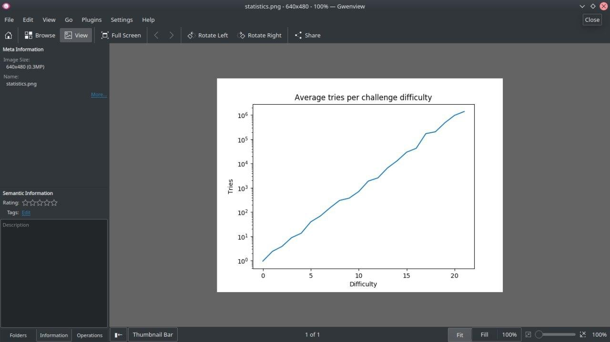

<div align="center">

# @credithub/jurischain

**SHA3-based Proof-of-Work captcha for fair access control.**
No tracking. No third parties. Fully open source.

[](LICENSE)
[](docker-compose.yml)
[](bindings/node)
[](bindings/php)

</div>

---

## Why JurisChain?

Traditional captchas (reCAPTCHA, hCaptcha) track users, sell data, and depend on external servers. JurisChain takes a different approach: instead of challenging *humans*, it challenges the *machine*.

The client must solve a SHA3-256 Proof-of-Work puzzle before submitting a request. This makes automated abuse computationally expensive while keeping the user experience seamless — no image grids, no cookies, no surveillance.

> **Inspired by the Brazilian judiciary's need** for open, self-hosted access control that complies with [Lei 11.419, Art. 14](http://www.planalto.gov.br/ccivil_03/_Ato2004-2006/2006/Lei/L11419.htm#art14) — mandating open source and uninterrupted access.

## How It Works

```
┌──────────┐       seed + difficulty       ┌──────────┐
│  Server   │ ───────────────────────────▸ │  Client   │
│           │                              │           │
│           │                              │  SHA3-256 │
│           │                              │  PoW loop │
│           │       solution hash          │     ⏳    │
│  verify() │ ◂─────────────────────────── │           │
└──────────┘                              └──────────┘
```

1. **Server** generates a random seed and chooses a difficulty (1–255)
2. **Client** receives the challenge and iterates SHA3-256 hashes until the result meets the difficulty threshold
3. **Client** sends the solution hash back to the server
4. **Server** verifies in O(1) — a single hash comparison

Higher difficulty = exponentially more work for the client, linearly tunable by the server.

## Features

| Feature | Description |
|---|---|
| **Privacy-first** | Zero cookies, fingerprinting, or external requests |
| **Portable** | Header-only C library — runs everywhere C compiles |
| **Multi-platform** | Bindings for Browser (WASM/ASM.js), Node.js, PHP 8, Python |
| **NIST standard** | SHA3-256 (Keccak) — winner of the NIST hash competition |
| **Dockerized** | One-command build, test, and serve via Docker Compose |
| **Tunable** | Difficulty 1–255, exponential scaling of client work |

## Quick Start

### Docker (recommended)

```bash
./build.sh build                 # Build ASM.js bundle
./build.sh test                  # Run all tests (PHP + Node + Python + ASM.js)
./build.sh serve                 # Serve demo → http://localhost:8080
```

### Individual tests

```bash
./build.sh test-php              # PHP 8 extension tests
./build.sh test-node             # Node.js native addon tests
./build.sh test-python           # Python smoke tests
./build.sh test-asm              # ASM.js CLI tests
```

### From source (no Docker)

```bash
make cli                         # Native CLI solver
make all                         # Emscripten ASM.js + bundle
sudo make install                # Install header to /usr/local/include
```

## API Reference

### Browser — Promise API

```html
<link href="style.css" rel="stylesheet" />
<div id="jurischain-captcha"></div>
<script src="dist/jurischain-bundle.js"></script>
<script>
  const hash = await solveJurischain({
    seed: 'server-generated-random-value',
    difficulty: 10,
    timeout: 30000,
  });
  // POST hash to server for verification
</script>
```

### C — Core Library

```c
#include "jurischain.h"

// Generate challenge
jurischain_ctx_t ctx;
jurischain_gen(&ctx, difficulty, seed, seed_len);

// Solve (client-side)
while (!jurischain_try(&ctx));

// Verify (server-side, O(1))
int valid = jurischain_verify(&ctx);  // 1 = valid, 0 = invalid
```

### Node.js — Native Addon

```bash
npm install @credithub/jurischain-node
```

```js
const { Jurischain } = require('@credithub/jurischain-node');

// Generate + solve
const challenge = new Jurischain(10, 'random-seed');
while (!challenge.solveStep());

// Read solution
const hash = challenge.readChallenge();

// Verify on server
const verifier = new Jurischain(10, 'random-seed');
verifier.challengeResponse(hash);
console.log(verifier.verify());  // true
```

### PHP 8 — Extension

```php
// Generate + solve
$challenge = new Jurischain($difficulty, $seed);
while (!$challenge->solve());
$hash = $challenge->getChallenge();

// Verify on server
$verifier = new Jurischain($difficulty, $seed);
$verifier->setResponse($_POST['jurischain']);
$valid = $verifier->verify();  // bool(true)
```

## Configuration

| Parameter | Type | Range | Description |
|---|---|---|---|
| `seed` | `string` | non-empty | Random value generated per-request by the server |
| `difficulty` | `uint8` | 1 – 255 | Number of leading zero bits required in the hash |
| `timeout` | `ms` | > 0 | Browser API only — max solve time before rejection |

### Difficulty guidelines

| Difficulty | Avg. tries | Typical time | Use case |
|---|---|---|---|
| 8–10 | ~500 | < 1s | Login forms, page views |
| 14–16 | ~30k | 2–5s | API rate limiting |
| 18–20 | ~200k | 10–30s | Heavy abuse prevention |

## Project Structure

```
@credithub/jurischain
├── include/              C header (header-only library)
│   └── jurischain.h
├── src/                  C source files
│   ├── cli.c             Native CLI solver
│   └── browser.c         Emscripten browser entry
├── bindings/
│   ├── browser/          JS Promise wrapper + bundle API
│   ├── node/             Node.js native addon (NAN + node-gyp)
│   └── php/              PHP 8 extension (phpize)
├── examples/
│   └── web/              Interactive browser demo
├── tests/                Integration & E2E tests
├── docker/               Dockerfiles + nginx config
├── scripts/              Utility scripts (genstats.py)
└── docs/images/          Documentation assets
```

## Statistics



Generate benchmark charts:

```bash
pip install -r requirements.txt
python3 scripts/genstats.py       # Results saved to stats/
```

## Security Considerations

- The **seed must be cryptographically random** and unique per request — reusing seeds allows replay attacks
- Verification is **server-side only** — never trust client-reported success
- Difficulty should be **tuned per endpoint** — higher for sensitive operations, lower for reads
- The SHA3-256 hash is **not reversible** — the server verifies by recomputing, not storing solutions

## Contributing

```bash
git clone https://github.com/credithub/jurischain.git
cd jurischain
./build.sh test                  # Verify everything passes
```

PRs welcome. Please ensure all tests pass before submitting.

## License

[MIT](LICENSE) — created by [CreditHub](https://credithub.com.br), maintained by [Lucas Fernando Amorim](https://github.com/lfamorim)
